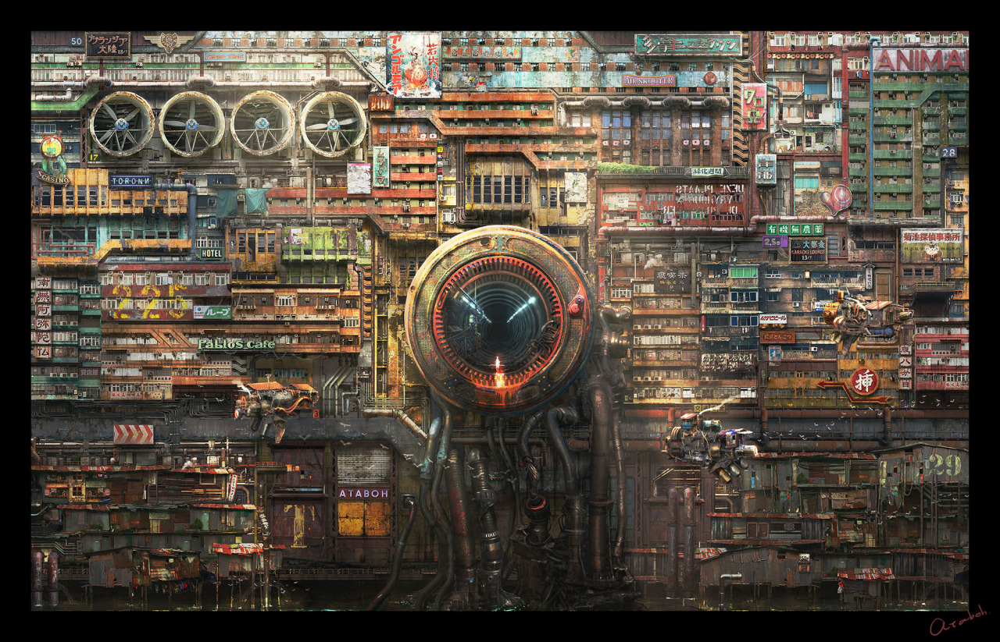

# Zach Goldstein
### Freelance software engineer
## golang/ruby/node
### Code Gypsy

---

# Slack + Typeform + Go + Firebase + Reactjs
### An Obyssey

---

## Build a slack bot that can create custom user-specific forms with typeform!

---

# High-level process:

---

## Somebody posts a message telling typebot to create a form

---

## Typebot creates forms with custom webhooks for everybody and DMs them a link

---

## People fill out the forms

---

## Typebot says thank you b/c he's classy

---

## Results populate a firebase DB

---

## A real-time synced page shows everybody results as they come in.

---

# Ok here we go....

---

# Let's begin with a question as old as the internet itself

---

# Would you rather fight....

---

# A thousand duck sized horses

---

# Or a horse sized duck

---

# Thanks!

