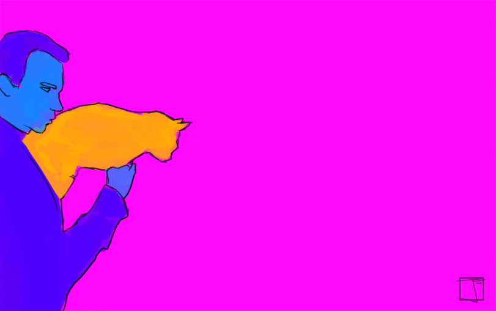

# Zach Goldstein
### Freelance golang/ruby/node engineer

---

# Slack + Typeform + Go
### An Obyssey

---

## Build a slack bot that can create user-tagged forms with typeform!

---

## Interact with the typeform API in golang
### Build out the basics of a wrapper lib

---

### Wrapper Lib!

---

# High-level process:

---

## Somebody posts a message telling typebot to do something

---

## Typebot creates tagged forms for everybody and DM's them a link

---

## People fill out the forms

---

## Typebot says thank you b/c he's classy

---

## Results populate a firebase DB

---

## A real-time synced page shows everybody results as they come in.

---

# Ok here we go....

---

# Let's begin with a question as old as the internet itself

---

# Would you rather fight....

---

# A thousand duck sized horses

---

# Or a horse sized duck

---

# Thanks!

